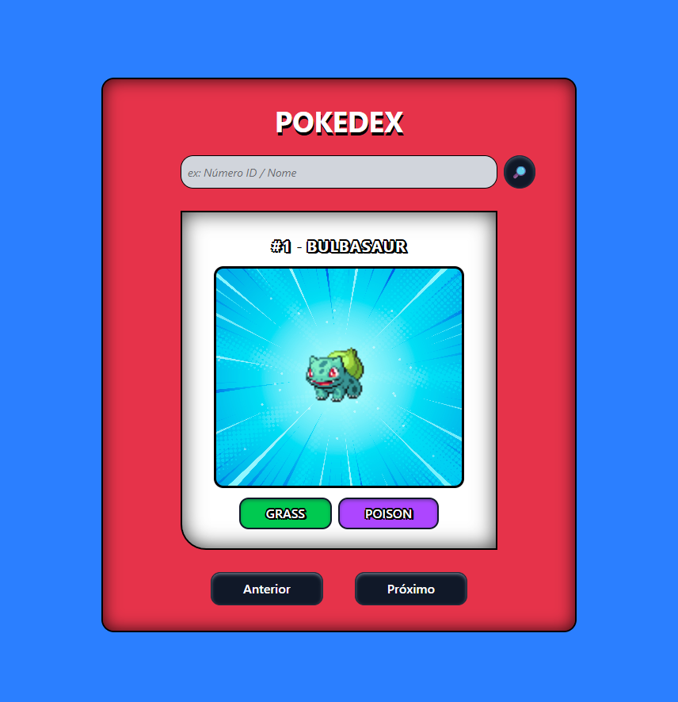

# Pokédex

Uma Pokédex desenvolvida com React, TypeScript e Tailwind CSS utilizando a PokéAPI.

## 📚 API

Este projeto utilizou a API **[PokéAPI](https://pokeapi.co/)** para obter todas as informações sobre os Pokémon.

## ✨ Funcionalidades

- 🔍 Pesquisa por nome ou ID
- ⬅️➡️ Navegação entre Pokémon
- 🎨 Tipos com cores personalizadas
- ⏳ Tela de carregamento
- ⚠️ Tratamento de erros
- 📱 Tela Responsiva

<!-- - 📱 Interface responsiva -->

## 🛠 Tecnologias

- React
- TypeScript
- Tailwind CSS
- Vite
- PokéAPI

<!-- - 
- 
- 
- 
-  -->

## 🚀 Como executar

### **Pré-requisito:** instale o [Node.js](https://nodejs.org/pt-br), recomenda-se a versão LTS.

---

### Clone o projeto

```bash
git clone https://github.com/SEU_USUARIO/pokedex_project.git
```

### Entre na pasta

```bash
cd pokedex_project
```

### Instale as dependências

```bash
npm install
```

### Execute

```bash
npm run dev
```

---

<h1 align="center"> 🖥️ Demonstração da Pokédex </h1>

<p align="center">
	
</p>

---
